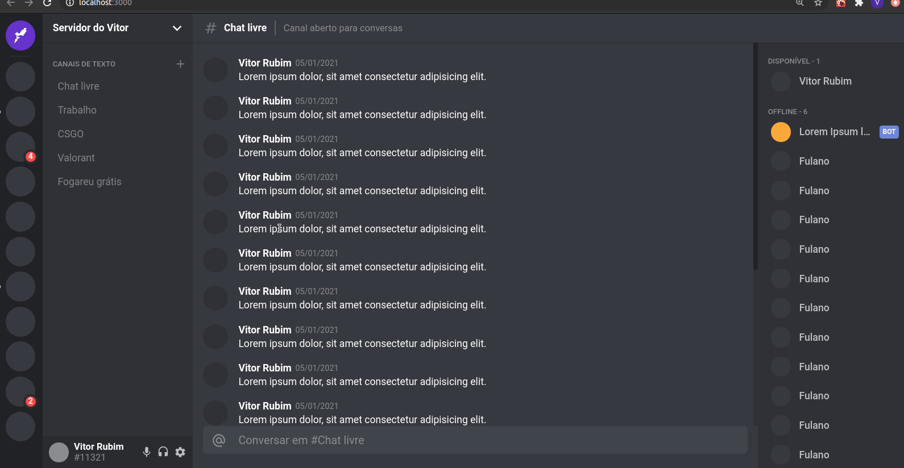

<h1 align="center">
  
</h1>

<h1 align="center">
  
</h1>

## Sobre

O projeto tem como intuito estudar alguns conceitos frontend, e pra isso fiz o clone da famosa interface do **Discord**, com auxílio da aula realizada pela **Rocketseat**, onde apresentou conceitos de grid layout e usabilidade da Stack JS e TS com **ReactJS** e **Styled Components**

---

## Tecnologias utilizadas 😏

- [ReactJS](https://pt-br.reactjs.org/)
- [Styled Components](https://styled-components.com/)
- [Typescript](https://www.typescriptlang.org/)

---

## 📁 Como baixar o projeto

```bash

  # Clonar o repositório 😀
  $ git clone https://github.com/vitorrubim1/uiCloneInterfaceDiscord

  # Entrar no repositório 💪
  $ cd uiCloneInterfaceDiscord

  # Instalar as dependências 📥
  $ yarn install

  # Iniciar o Projeto 🔥🔥
  $ yarn start
```

<p align="center"> Desenvolvido com ❤️ por Vitor Rubim </p>
